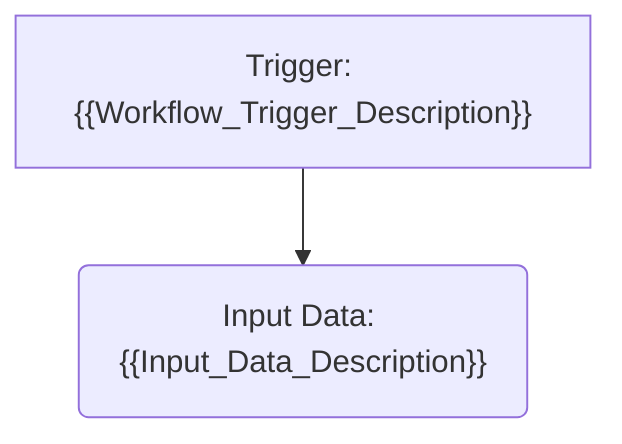
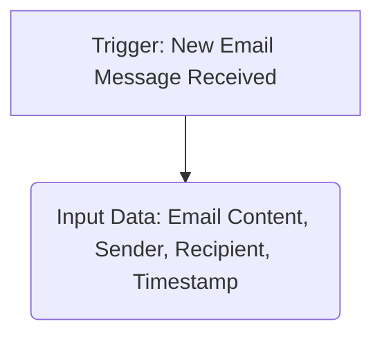
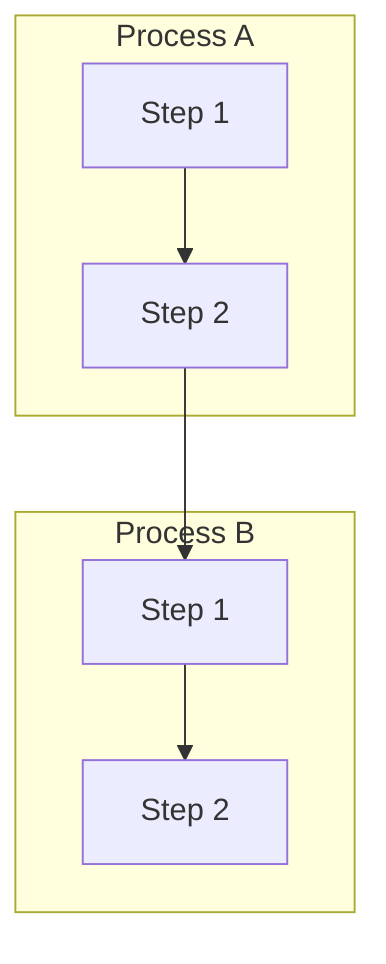
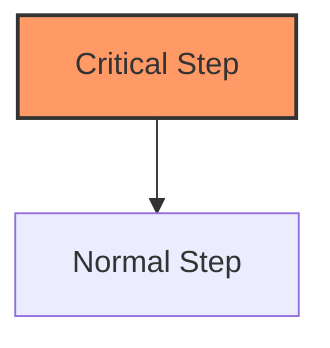
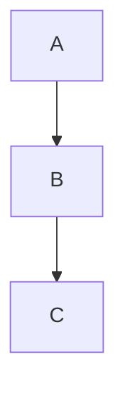

# Mermaid Flowchart Guide

This guide will help you work with the Mermaid flowchart diagrams included in the workflow templates.

## What is Mermaid?

[Mermaid](https://mermaid-js.github.io/mermaid/) is a JavaScript-based diagramming and charting tool that renders Markdown-inspired text definitions to create diagrams dynamically. All workflow templates in this repository use Mermaid syntax to define workflow diagrams.

## Viewing Mermaid Diagrams

The flowchart templates (`*_flowchart_template.md` files) contain Mermaid syntax enclosed in code blocks. There are several ways to view these diagrams:

### 1. Visual Studio Code

**Recommended Option:** VS Code provides excellent Mermaid support through extensions.

1. Install the [Markdown Preview Mermaid Support](https://marketplace.visualstudio.com/items?itemName=bierner.markdown-mermaid) extension
2. Open any `*_flowchart_template.md` file
3. Click the "Preview" button or press `Ctrl+Shift+V` (Windows/Linux) or `Cmd+Shift+V` (Mac)
4. The diagram will render in the preview pane

### 2. Online Mermaid Editor

The [Mermaid Live Editor](https://mermaid.live/) is a free online tool for creating, editing, and viewing Mermaid diagrams.

1. Copy the Mermaid code from any flowchart template (the content between ````mermaid` and ``````)
2. Paste it into the Mermaid Live Editor
3. The diagram will render instantly in the preview panel

### 3. GitHub

If you host your implementation on GitHub, Mermaid diagrams in Markdown files are automatically rendered in the web interface.

### 4. Mermaid CLI

For batch processing or automation, you can use the [Mermaid CLI](https://github.com/mermaid-js/mermaid-cli) to generate image files from Mermaid diagrams.

```
npm install -g @mermaid-js/mermaid-cli
mmdc -i input.md -o output.png
```

## Customizing Flowcharts

When implementing the workflow templates, you'll need to customize the flowcharts to match your specific implementation.

### Editing Syntax

Mermaid flowcharts use a simple syntax:

```
graph TD
    A[Start] --> B{Decision}
    B -- Yes --> C[Action 1]
    B -- No --> D[Action 2]
```

Key elements:
- `graph TD`: Defines a top-down graph
- `A[Start]`: Node with label "Start"
- `-->`: Arrow connecting nodes
- `B{Decision}`: Decision node with diamond shape
- `B -- Yes --> C`: Arrow with text label

### Common Customizations

1. **Replace placeholder text:**
   - Look for descriptive text inside brackets: `[Placeholder Text]`
   - Replace with your actual system components and actions

2. **Adjust flow logic:**
   - Add or remove decision points based on your implementation
   - Ensure all paths lead to a valid endpoint

3. **Update styling:**
   - Each template includes CSS classes at the bottom
   - Modify colors or styles to match your system's visual language

### Example Customization

Original template code:


Customized code:


## Debugging Flowcharts

If your Mermaid diagram isn't rendering correctly:

1. **Check syntax:**
   - Ensure arrows have correct formatting (`-->`, `--->`), not dashes or equals signs
   - Verify nodes have unique identifiers
   - Make sure all brackets and parentheses are balanced

2. **Simplify and test:**
   - Remove complex parts temporarily to identify problematic sections
   - Try rendering a minimal diagram first, then add complexity

3. **Use the Mermaid Live Editor:**
   - It provides real-time feedback and error messages
   - The syntax checker will highlight problems

## Advanced Techniques

### 1. Subgraphs

Subgraphs help organize complex diagrams into logical sections:



### 2. Custom Styling

Apply custom styles to nodes or groups:



### 3. Comments

Add comments to your Mermaid code using `%%`:



## Resources

- [Official Mermaid Documentation](https://mermaid-js.github.io/mermaid/)
- [Mermaid Live Editor](https://mermaid.live/)
- [Mermaid Flow Chart Syntax](https://mermaid-js.github.io/mermaid/#/flowchart)
- [Mermaid CLI](https://github.com/mermaid-js/mermaid-cli)

## Need Help?

If you encounter issues with the flowchart templates that aren't resolved by this guide, refer to the Troubleshooting Guide or contact your implementation team for assistance. 