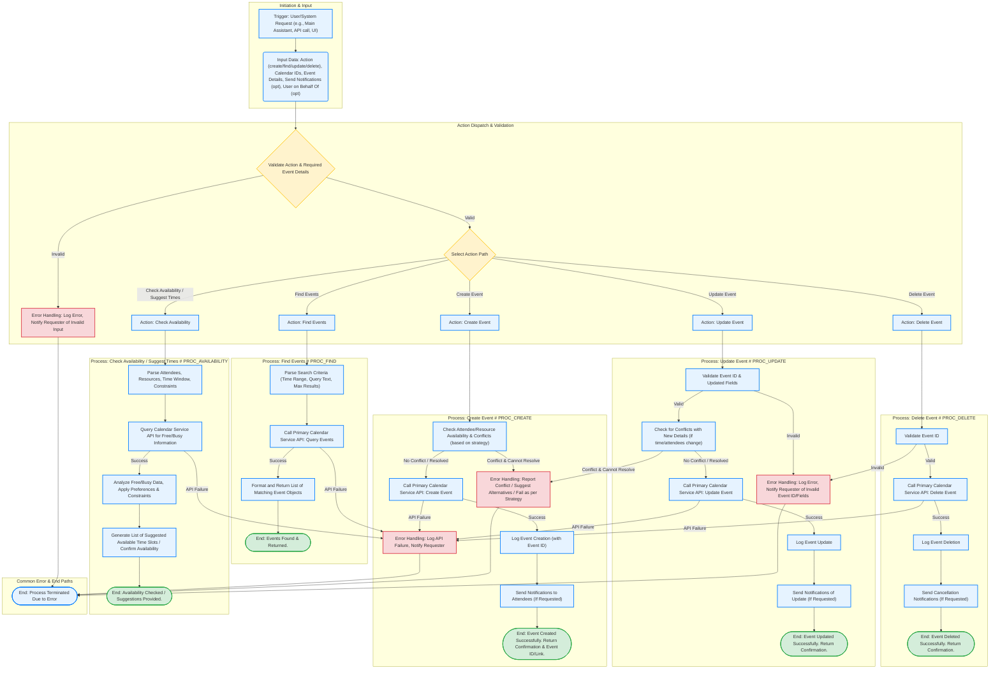

### Flowchart: Mcp Calendar - Event Management Process

**Description:** This flowchart illustrates the common processes for the Mcp Calendar assistant, including creating, finding, updating, and deleting calendar events, as well as checking availability.

**Key Elements Customized for Mcp Calendar:**
*   **Multiple Action Paths:** The main dispatcher `D` routes to sub-processes for Create, Find, Update, Delete, and Check Availability.
*   **Conflict Checking:** Prominent in Create and Update flows, with decisions based on configured strategy.
*   **API Interaction:** All core actions involve calls to the Primary Calendar Service API.
*   **Notification Handling:** Explicit steps for sending notifications for event changes.
*   **Specific Inputs/Outputs:** Each sub-process details its specific data handling (e.g., event IDs, search criteria, lists of events, time slots).
*   **Error Handling:** Tailored error paths for invalid inputs, conflicts, API failures, and invalid event IDs.

