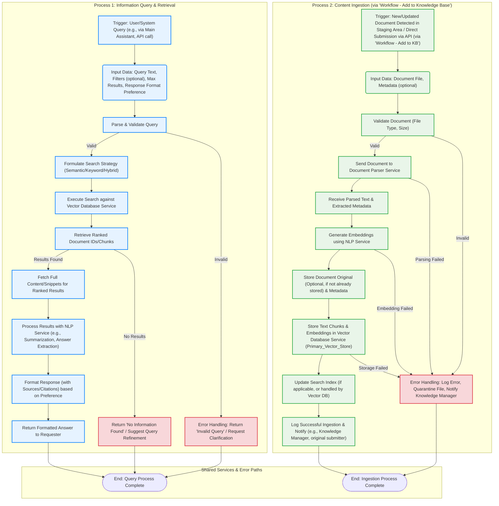

### Flowchart: Mcp Knowledge Base - Query & Ingestion Process

**Description:** This flowchart illustrates the two primary processes of the Mcp Knowledge Base: 1) Handling user queries for information retrieval, and 2) Ingesting new or updated documents into the knowledge base.

**Key Elements Customized for Mcp Knowledge Base:**
*   **Two Main Processes:** Clearly distinguishes between information retrieval (querying) and content ingestion.
*   **Query Process Trigger:** User/system queries.
*   **Query Input Data:** Natural language query, optional filters, result limits, format preferences.
*   **Query Validation:** Basic checks on query structure or length.
*   **Query Decision/Action:** Involves search strategy (semantic/keyword), interaction with Vector DB and NLP services.
*   **Query Output:** Formatted answers with sources.
*   **Ingestion Process Trigger:** New/updated documents, often managed by the "Workflow - Add to Knowledge Base".
*   **Ingestion Input Data:** Document files and metadata.
*   **Ingestion Validation:** File type and size checks.
*   **Ingestion Actions:** Document parsing, embedding generation, storage in Vector DB, index updates.
*   **Ingestion Output:** Confirmation of successful ingestion or error details.
*   **Error Handling:** Specific error paths for both query and ingestion processes, including notifications to relevant parties (e.g., Knowledge Manager).
*   **Shared Services:** Highlights reliance on Document Parser, NLP Service, and Vector Database Service.

